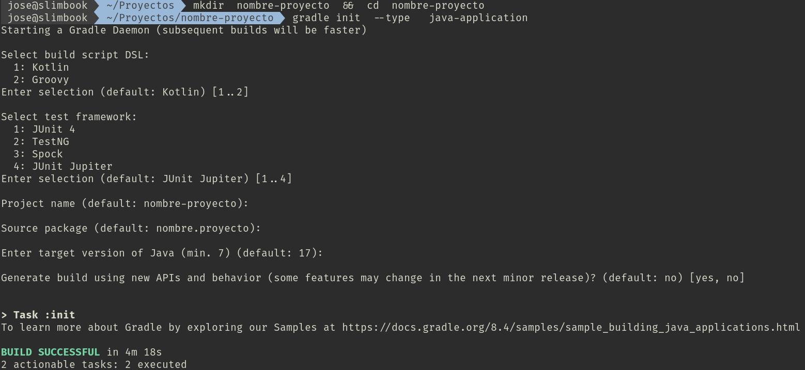
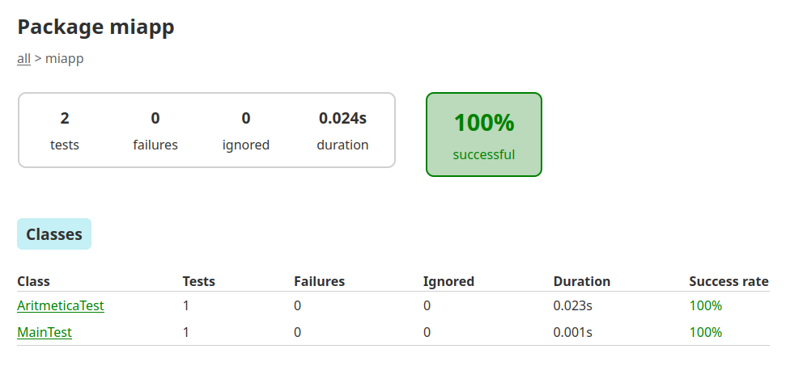

# Generando proyectos Java con Gradle


Gradle es una herramienta para la gestión y construcción de proyectos Java.

De los sistemas de construcción para Java, Gradle es el último en aparecer: el primero fue _ant_ y el segundo _maven_. 

Gradle construye sobre los conceptos de Apache Ant y Apache Maven e introduce un lenguaje especifico del dominio (DSL) basado en Groovy o en Kotlin en vez de la forma XML utilizada por Apache Maven y Ant para declarar la configuración de proyecto.
Esta característica hace que el buildfile de gradle sea más conciso y legible.

Al igual que Maven, Gradle trabaja con uno o varios repositorios para usar en red. También al igual que Maven, soporta plugins.

Gradle tiene las siguientes ventajas sobre ant y maven:

- es más rápido que maven y ant para grandes proyectos.
- es organizado como maven sin ser rígido y flexible como ant sin tener que especificar cada tarea.
- tiene soporte para otros lenguajes como C y C++.
- por defecto agrega la dependencia para tests unitarios de JUnit.

Gradle tiene las siguientes desventajas sobre ant y maven:

- tiene peor integración con los IDEs.
- para pequeños proyectos pueden ser más adecuados otros sistemas de construcción.

## Prerequisitos

Para seguir las siguientes instrucciones en necesario tener instalados los siguientes paquetes:

- JDK
- Gradle

Si trabajas con JDK 17 o superior, necesitarás instalar al menos la versión 7.3 de Gradle. 

En los repositorios de Ubuntu la versión de gradle suele estar bastante anticuada. Por tanto te recomiendo instales una versión fuera de los repositorios.

Para instalar, ejecutamos:

```sh

sudo  apt  install  openjdk-17-jdk       # Instalamos JDK 17
curl -s "https://get.sdkman.io" | bash   # Instalamos SDKMAN
sdk install gradle 8.4                   # Instalamos Gradle
```


## Creación de proyecto

```
mkdir  nombre-proyecto  &&  cd  nombre-proyecto
gradle init  --type   java-application
```

Los tipos de proyectos disponibles son: 
- basic
- cpp-application
- cpp-library
- groovy-application
- groovy-gradle-plugin
- groovy-library
- java-application
- java-gradle-plugin
- java-library
- kotlin-application
- kotlin-gradle-plugin
- kotlin-library
- pom
- scala-application
- scala-library
- swift-application
- swift-library

Podemos ver la lista anterior con el comando `gradle help --task :init`



> NOTA: He seleccionado todas las opciones por defecto: Kotlin, JUnit Jupiter, ...

El comando anterior genera una estructura de directorios como la mostrada a continuación:

```
tree

.
├── app
│   ├── build.gradle.kts
│   └── src
│       ├── main
│       │   ├── java
│       │   │   └── nombre
│       │   │       └── proyecto
│       │   │           └── App.java
│       │   └── resources
│       └── test
│           ├── java
│           │   └── nombre
│           │       └── proyecto
│           │           └── AppTest.java
│           └── resources
├── gradle
│   └── wrapper
│       ├── gradle-wrapper.jar
│       └── gradle-wrapper.properties
├── gradlew
├── gradlew.bat
└── settings.gradle.kts


```

Se generan 2 _wrappers_ :

- gradlew     (para entornos Linux)
- gradlew.bat (para entornos Windows)

Es aconsejable utilizar estos _wrappers_ o _envoltorios_ puesto que hacen más portable la construcción en equipos con versiones de gradle distintas a las utilizadas por nosotros. No obstante, si no necesitamos construir en otros equipos distintos al nuestro puede utilizarse `gradle` directamente. Para ir adquiriendo buenos hábitos, en el ejemplo mostrado más abajo, se hará uso del wrapper `./gradlew`.

El archivo de construcción `app/build.gradle.kts` tiene un contenido similar a este:


```
plugins {
    application
}

repositories {
    mavenCentral()
}

dependencies {
    testImplementation("org.junit.jupiter:junit-jupiter:5.9.3")

    testRuntimeOnly("org.junit.platform:junit-platform-launcher")

    // This dependency is used by the application.
    implementation("com.google.guava:guava:32.1.1-jre")
}

// Apply a specific Java toolchain to ease working on different environments.
java {
    toolchain {
        languageVersion.set(JavaLanguageVersion.of(17))
    }
}

application {
    mainClass.set("nombre.proyecto.App")
}

tasks.named<Test>("test") {
    // Use JUnit Platform for unit tests.
    useJUnitPlatform()
}
```


## Tareas (tasks)

Gradle ya tiene predefinidas una serie de tareas (__tasks__, en terminología de gradle).

Las tareas predefinidas pueden verse con el comando:

__``` ./gradlew  tasks ```__

```
> Task :tasks

------------------------------------------------------------
Tasks runnable from root project 'nombre-proyecto'
------------------------------------------------------------

Application tasks
-----------------
run - Runs this project as a JVM application

Build tasks
-----------
assemble - Assembles the outputs of this project.
build - Assembles and tests this project.
buildDependents - Assembles and tests this project and all projects that depend on it.
buildNeeded - Assembles and tests this project and all projects it depends on.
classes - Assembles main classes.
clean - Deletes the build directory.
jar - Assembles a jar archive containing the classes of the 'main' feature.
testClasses - Assembles test classes.

Build Setup tasks
-----------------
init - Initializes a new Gradle build.
wrapper - Generates Gradle wrapper files.

Distribution tasks
------------------
assembleDist - Assembles the main distributions
distTar - Bundles the project as a distribution.
distZip - Bundles the project as a distribution.
installDist - Installs the project as a distribution as-is.

Documentation tasks
-------------------
javadoc - Generates Javadoc API documentation for the 'main' feature.

Help tasks
----------
buildEnvironment - Displays all buildscript dependencies declared in root project 'nombre-proyecto'.
dependencies - Displays all dependencies declared in root project 'nombre-proyecto'.
dependencyInsight - Displays the insight into a specific dependency in root project 'nombre-proyecto'.
help - Displays a help message.
javaToolchains - Displays the detected java toolchains.
kotlinDslAccessorsReport - Prints the Kotlin code for accessing the currently available project extensions and conventions.
outgoingVariants - Displays the outgoing variants of root project 'nombre-proyecto'.
projects - Displays the sub-projects of root project 'nombre-proyecto'.
properties - Displays the properties of root project 'nombre-proyecto'.
resolvableConfigurations - Displays the configurations that can be resolved in root project 'nombre-proyecto'.
tasks - Displays the tasks runnable from root project 'nombre-proyecto' (some of the displayed tasks may belong to subprojects).

Verification tasks
------------------
check - Runs all checks.
test - Runs the test suite.

.
.
.
```

Como se observa se distinguen 6 tipos de tareas, entre otras:

- Tarea de ejecución:
  - `run`

- Tareas de construcción, entre otras:
  - `build`
  - `jar`
  - `clean`

- Tareas de configuración, entre otras:
  - `init`
  
- Tarea de documentación:
  - `javadoc`

- Tareas de ayuda, entre otras:
  - `tasks`
  - `help`
  
- Tareas de verificación, entre otras:
  - `test`

El significado de cada tarea resulta bastante evidente debido a su semejanza respecto a otros sistemas de construcción.

Por ejemplo, para compilar, construir y realizar tests de unidad ejecutaremos:

```
./gradlew  build
```

Todos los archivos generados durante la construcción se guardan en la carpeta `app/build`. En la subcarpeta `app/build/libs` se guarda el archivo `.jar`.


## Ejemplo práctico

Vamos a crear una aplicación llamada `miapp`. Constará de 2 clases, una principal y otra con la funcionalidad para realizar las cuatro operaciones aritméticas básicas. 

Para ello sigue los siguientes pasos:

0. En tu carpeta de proyectos crea una carpeta llamada miapp y entra en ella: 

```
cd  ~/Proyectos
mkdir  miapp  &&  cd  miapp
```

1. Crea la estructura de carpetas con gradle:

```
gradle  init  --type  java-application
```

2. Veras que se han creado una estructura de directorios y un _buildfile_ llamado __app/build.gradle.kts__.

```
tree    

.
├── app
│   ├── build.gradle.kts
│   └── src
│       ├── main
│       │   ├── java
│       │   │   └── miapp
│       │   │       └── App.java
│       │   └── resources
│       └── test
│           ├── java
│           │   └── miapp
│           │       └── AppTest.java
│           └── resources
├── gradle
│   └── wrapper
│       ├── gradle-wrapper.jar
│       └── gradle-wrapper.properties
├── gradlew
├── gradlew.bat
└── settings.gradle.kts
```


3. Genera el siguiente código fuente:

__Primero, borra las clases que vienen por defecto:__

```
rm  app/src/main/java/miapp/App.java  app/src/test/java/miapp/AppTest.java
```

__Crea 2 clases dentro de la ruta `app/src/main/java/miapp`:__

```
nano  app/src/main/java/miapp/Main.java
```


```java
package miapp;

public class Main {

  private static final int NUM1 = 5;
  private static final int NUM2 = 2;


  public static void main (String[] args) {
    System.out.println ("Dados los números " + NUM1 + " y " + NUM2 );
    System.out.println ("La suma es " + Aritmetica.suma(NUM1, NUM2) );
    System.out.println ("La resta es " + Aritmetica.resta(NUM1, NUM2) );
    System.out.println ("La multiplicación es " + Aritmetica.multiplicacion(NUM1, NUM2) );
    System.out.println ("La división es " + Aritmetica.division(NUM1, NUM2) );
  }
}
```

```
nano  app/src/main/java/miapp/Aritmetica.java
```


```java
package miapp;

public class Aritmetica {

  public static int suma (int sumando1, int sumando2) {
        return (sumando1+sumando2);
  }

  public static int resta  (int minuendo, int sustraendo) {
        return (minuendo-sustraendo);
  }

  public static int multiplicacion (int  numero1, int numero2) {
        return (numero1*numero2);
  }

  public static float division (int dividendo, int divisor) {
        return (dividendo/(float)divisor);
  }

}
```

__Crea 2 clases de test dentro de la ruta `app/src/test/java/miapp`:__

```
nano  app/src/test/java/miapp/MainTest.java
```

```java
package miapp;

import org.junit.jupiter.api.Test;  
import static org.junit.jupiter.api.Assertions.*;

public class MainTest {

  @Test
  public void testMain() {
      // Prueba vacía
  }
}
```

```
nano  app/src/test/java/miapp/AritmeticaTest.java
```

```java
package miapp;

import org.junit.jupiter.api.Test;  
import static org.junit.jupiter.api.Assertions.*;

public class AritmeticaTest {
    
    @Test 
    public void testSuma() {
        assertEquals(5, Aritmetica.suma(2,3), "Suma (2,3) = 5");
    }

}
```


4. Edita el archivo `app/build.gradle.kts` para que tenga el siguiente contenido:

```
plugins {
    application
}

repositories {
    mavenCentral()
}

dependencies {
    testImplementation("org.junit.jupiter:junit-jupiter:5.9.3")

    testRuntimeOnly("org.junit.platform:junit-platform-launcher")

    // This dependency is used by the application.
    implementation("com.google.guava:guava:32.1.1-jre")
}

// Apply a specific Java toolchain to ease working on different environments.
java {
    toolchain {
        languageVersion.set(JavaLanguageVersion.of(17))
    }
}

application {
    mainClass.set("miapp.App")
}

tasks.named<Test>("test") {
    // Use JUnit Platform for unit tests.
    useJUnitPlatform()
}

tasks.withType<Jar> {
    manifest {
        attributes["Main-Class"] = "miapp.Main"
    }
}
```


5. Para compilar hacemos:

```
./gradlew  assemble
```

En la carpeta `app/build/classes/java/main` obtendremos el bytecode correspondiente a cada clase.


Una forma de ejecutar el bytecode es:

```bash
cd app/build/classes/java/main  &&  java miapp.Main  &&  cd ../../../../..
```


6. El archivo .jar se ha guardado en la carpeta `app/build/libs`. Para ejecutar dicho archivo .jar:

```
./gradlew  run
```

Otra forma de ejecutarlo es

```
java  -jar  app/build/libs/app.jar
```

7. Para ejecutar las pruebas unitarias:

```
./gradlew  test
```

Para ver un informe de las pruebas, podemos abrir con el navegador web el archivo `app/build/reports/tests/test/index.html`:

```
firefox app/build/reports/tests/test/index.html
```




Si obtenemos algún error, podemos limpiar la construcción con `./gradlew  clean`. Revisaremos el código y volveremos a empezar.


---

> Referencias: 
>
> - https://www.arquitecturajava.com/que-es-gradle/
> - https://gradle.org/guides/#getting-started
> - https://guides.gradle.org/building-java-applications/
> - https://guides.gradle.org/building-java-libraries/

